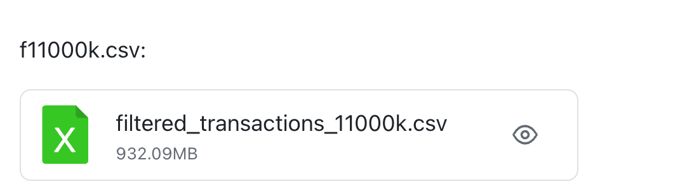

# taxpool-sim

## 使用说明

1. **克隆仓库**

```bash
git clone https://github.com/acciomerlin/taxpool-sim.git
cd taxpool-sim
```

2. **准备数据文件**

由于 Git LFS 限额，`filtered_transactions_11000k.csv` 这个只包含非合约交易的数据集无法上传，我放到飞书了：



放到项目根目录：

```
./filtered_transactions_11000k.csv
```

3. **运行模拟器**

在 IDE 中打开本项目（如 GoLand），直接运行 `main.go` 或使用命令行：

```bash
go build -o taxsim main.go
./taxsim
```

几秒后将看到控制台打印类似如下信息：

```bash
📊 正在读取交易：已读取 299308 / 3607054 (8.30%)，耗时 2.00 秒
📊 正在读取交易：已读取 589658 / 3607054 (16.35%)，耗时 4.00 秒
...
📊 正在读取交易：已读取 3391123 / 3607054 (94.01%)，耗时 20.00 秒

Process finished with the exit code 0
```

运行完毕后将生成以下文件：

```
 outputCSV/
  └── shard_20250620_010344.csv    # 出块统计数据，按时间戳命名

 exp.log                          # 日志文件（记录打包流程、延迟等信息）
```

------

4. **绘图分析**

使用 Python 脚本 `draw.py` 进行结果可视化

```bash
pip install pandas matplotlib  //如果没装
```

然后修改 `draw.py` 中的路径：

```python
df = pd.read_csv("outputCSV/shard_20250620_010344.csv")  # 替换为你生成的 CSV 文件名
```

执行绘图脚本：

```bash
python draw.py
```

输出图保存在：

```
output_plots/
└── shard0_overview_m3.png
```

图中将展示 Tax/Subsidy 、f_itx_min&f_ctx_min、balance/delta balance，其他的block emulator的绘图代码我先注释掉了，代码放在figureplot/下面。

## 项目结构概览

```

taxpool_sim/
├── main.go               // 主程序入口：启动读取、打包、写出三大协程
├── txpool.go             // TxPool 交易池结构定义与打包逻辑
├── taxpool.go            // TaxPool 结构定义与动态调节算法（v1/v2/v3/v3.2）
├── transaction.go        // 交易结构
├── utils.go              // 辅助函数，如 Addr2Shard、isCtx 等
├── outputCSV/            // 出块统计信息输出目录
├── exp.log               // 日志文件
├── filtered_transactions_11000k.csv // 预处理交易数据文件（模拟交易）
└── draw.py               // Python 可视化脚本
```

